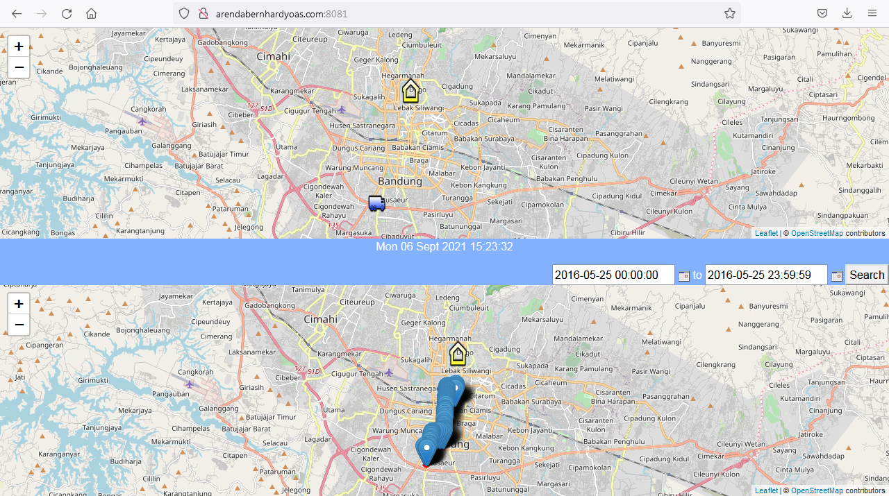
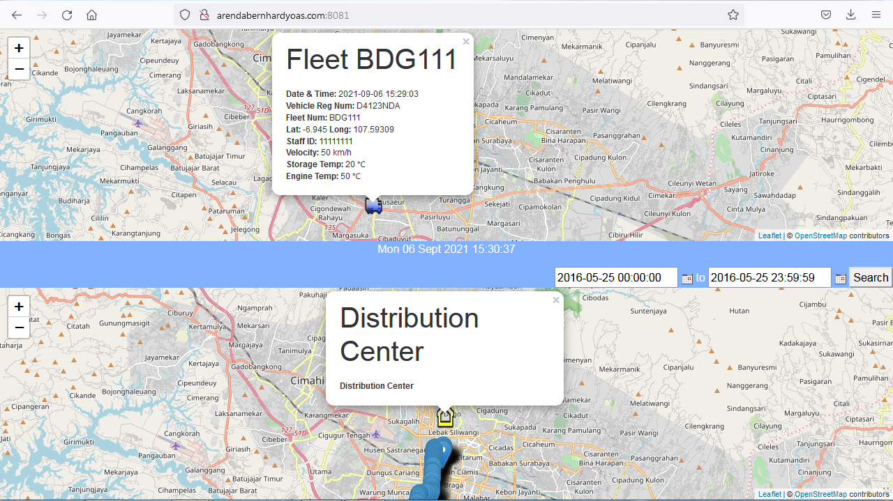
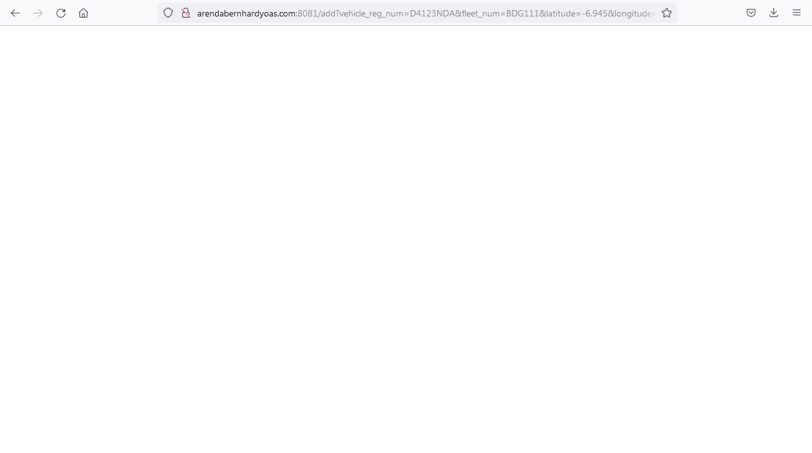

# Monitoring Vehicle

## Build interface and data processing vehicle location, velocity and temperature from field instrument.

### Descriptions

* Using NodeJS runtime stack version 14 LTS
* Using LeafletJS [here](https://leafletjs.com)
* Using jQuery [here](https://jquery.com/download/)
* Using MDBootstrap 5 [here](https://mdbootstrap.com/docs/standard/getting-started/installation/)
* Using PostgreSQL

Field instrument can be microcontroller with GPS model and temperature sensor. 
Vehicle location, velocity and temperature from field instrument sending data with HTTP request GET method. 
String HTTP request GET: 
`http://[ip address or domain]:[port]/add?vehicle_reg_num=[vehicle registration number]&fleet_num=[fleet number]&latitude=[latitude value]&longitude=[longitude value]&staff_id=[staff id]&velocity=[velocity value]&storage_temp=[storage temperature value]&engine_temp=[engine temperature value]` 

### Result
Main Page 

HTTP Request GET 

